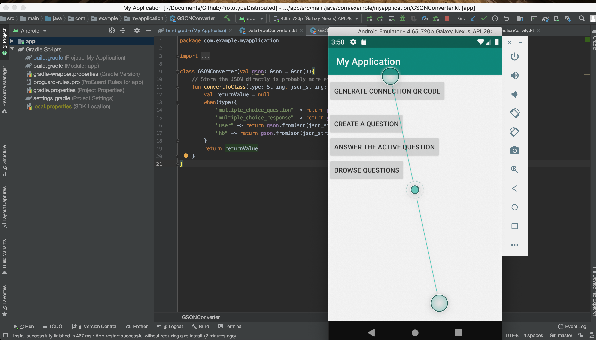
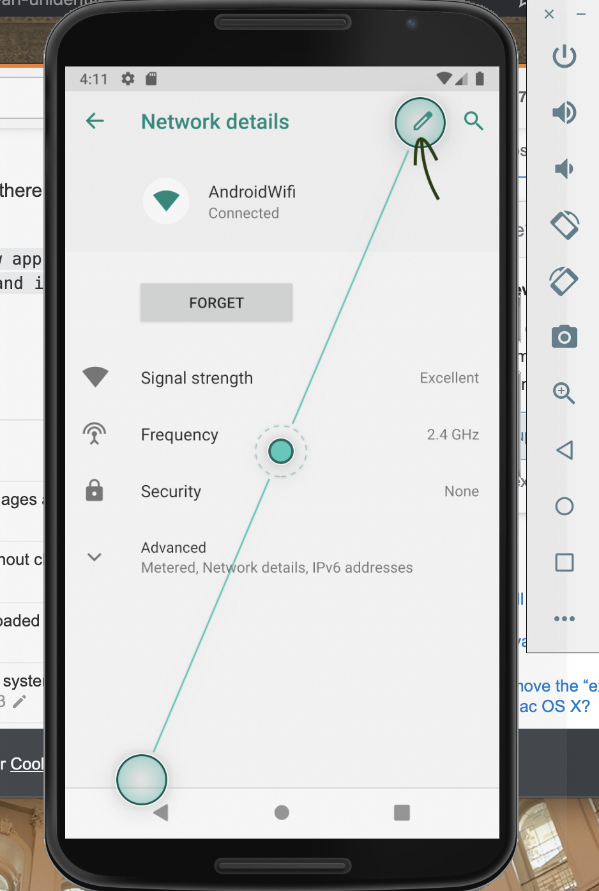
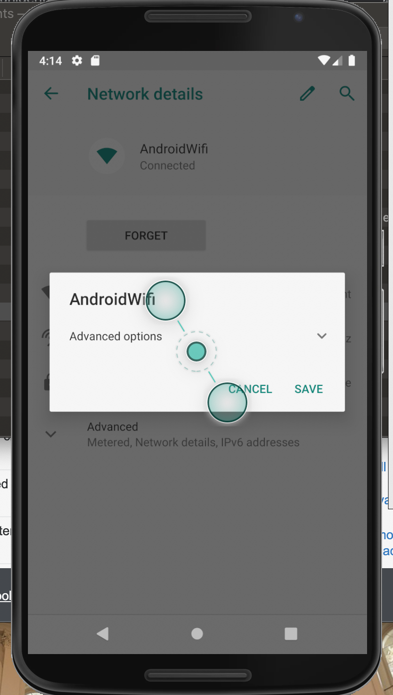
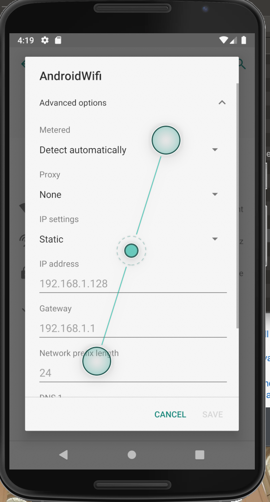
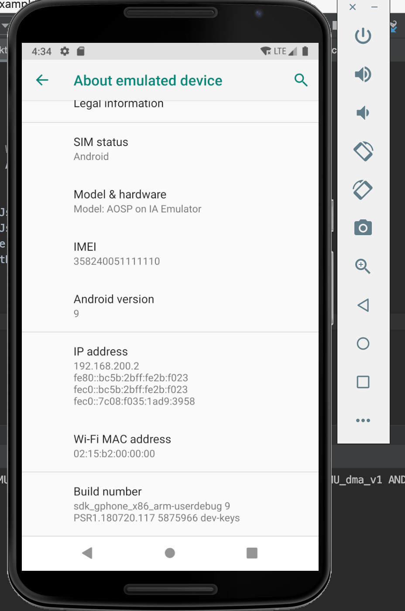

# Running the Application via an Emulator

### Configuring Emulator Port-Forwarding on MacOSX:

1). Install `adb` with the following `brew` command:

```bash
$ brew cask install android-platform-tools

==> Downloading https://dl.google.com/android/repository/platform-tools_r29.0.6-
######################################################################## 100.0%
==> Verifying SHA-256 checksum for Cask 'android-platform-tools'.
==> Installing Cask android-platform-tools
==> Linking Binary 'adb' to '/usr/local/bin/adb'.
==> Linking Binary 'dmtracedump' to '/usr/local/bin/dmtracedump'.
==> Linking Binary 'etc1tool' to '/usr/local/bin/etc1tool'.
==> Linking Binary 'fastboot' to '/usr/local/bin/fastboot'.
==> Linking Binary 'hprof-conv' to '/usr/local/bin/hprof-conv'.
==> Linking Binary 'mke2fs' to '/usr/local/bin/mke2fs'.
🍺  android-platform-tools was successfully installed!
```

2). Verify that `adb` was installed correctly by opening Android Studio and launching a device emulator instance (the kind of device does not matter).



Leave the emulator device running. `adb`can detect any active emulator instances. Run the following command to list all of the instances that `adb` has detected.  The emulator instance, along with its port number, will be displayed.

```bash
$ adb devices
List of devices attached
emulator-5554	device
```

If multiple devices were running, the `adb devices` command would return a list of all running emulators. The example above shows a list of emulators when a single emulator instance exists, the following list will be displayed if two emulators are running simultaneously:


```bash
$ adb devices
List of devices attached
emulator-5554	device
emulator-5556	device
```

3). Choose one of the emulators to behave as the server. In this walkthrough, the emulator named `emulator-5554` will be configured to run as the server.  The configuration steps are as follows:

a. Navigate to `Settings -> Network & internet -> Wi-Fi -> AndroidWiFi`.  Then, click on the edit button on the top right-hand side of the screen:



b. This will open a pop-up. Click on `Advanced Options`:



c. You are will now be able to modify the device's network settings. First, you'll notice the `IP Settings` are `DHCP` by default. Click on the `IP Settings` drop-down and select `static`.  You will now see a form that looks like below:



d. Populate the `IP address` section with the IP `10.0.2.18` as follows:


e. Click on `SAVE`.

### Enable the Server Emulator's `Developer Mode`

On your Server emulator device, navigate to `Settings -> About emulated device`.  Now, scroll all the way to the bottom of the screen, and click on the `Build number` label 7 times. This will activate `Developer Mode` and will automatically allow USB debugging on your emulator:



### Configuring Port Forwarding on the Server Emulator:

1). Now that your emulator is configured, you need to configure adb to forward packets to your emulator.  To do this, run the following command to telnet into your emulator, which is running on port 5554 (as specified in the following command):

```bash
$ telnet localhost 5554
Trying ::1...
Connected to localhost.
Escape character is '^]'.
Android Console: Authentication required
Android Console: type 'auth <auth_token>' to authenticate
Android Console: you can find your <auth_token> in
'/Users/vismarkjuarez/.emulator_console_auth_token'
OK
```

2). As seen in the output message above, you will be prompted to enter an authentication token. You will also be given the exact location for this token. Retrieve it, copy it and paste it as an argument in the following command:

```bash
auth Bakox7Ngcdg0jJ6a
```

Up to this point, your output should look somewhat like this:
```bash
$ telnet localhost 5554
Trying ::1...
Connected to localhost.
Escape character is '^]'.
Android Console: Authentication required
Android Console: type 'auth <auth_token>' to authenticate
Android Console: you can find your <auth_token> in
'/Users/vismarkjuarez/.emulator_console_auth_token'
OK
auth Bakox7Ngcdg0jJ6a
Android Console: type 'help' for a list of commands
OK
```

3). You are now ready to send commands to your emulator. The only command you need to make on your server emulator is the following:

```bash
redir add udp:5023:5024
```

That will redirect any data to your emulator.
